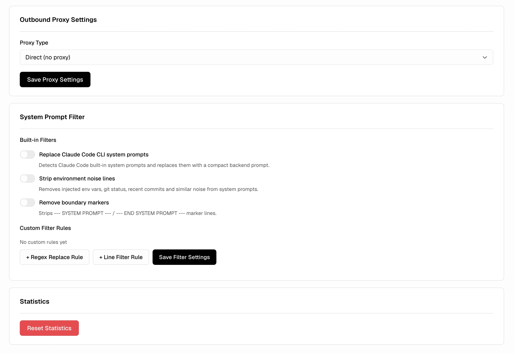
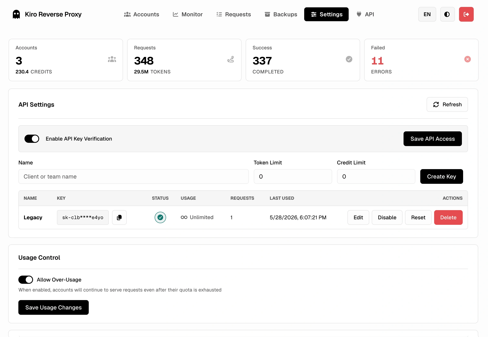

<div align="center">


# Kiro Proxy

#### Local proxy that converts Kiro accounts into OpenAI / Anthropic compatible endpoints.

<p>
  <a href="https://go.dev/"></a>
  <a href="https://www.docker.com/"></a>
  <a href="https://www.sqlite.org/"></a>
  <a href="LICENSE"></a>
</p>

<p>
  <a href="#-overview">Overview</a> •
  <a href="#-preview">Preview</a> •
  <a href="#-features">Features</a> •
  <a href="#-quick-start">Quick&nbsp;Start</a> •
  <a href="#-configuration">Configuration</a> •
  <a href="#-usage">Usage</a> •
  <a href="#-thinking-mode">Thinking&nbsp;Mode</a> •
  <a href="#-outbound-proxy">Outbound&nbsp;Proxy</a> •
  <a href="#-environment-variables">Env&nbsp;Vars</a> •
  <a href="#-safety">Safety</a>
</p>

[English](README.md) • [中文](README_CN.md)

</div>

---

## 🌟 Overview

**Kiro Proxy** is a small Go service that turns one or more authorized **Kiro** accounts into a local API endpoint that speaks the **OpenAI** and **Anthropic** wire formats:

1. Pools multiple Kiro accounts and load-balances requests with round-robin.
2. Translates Anthropic `/v1/messages`, OpenAI `/v1/chat/completions`, and OpenAI `/v1/responses` calls to and from Kiro upstream.
3. Refreshes access tokens automatically and streams Server-Sent Events end-to-end.
4. Ships with a polished web admin panel for account management, observability, and request audit.

> [!IMPORTANT]
> Single-binary local proxy. **Not** a hosted service, **not** affiliated with Amazon, AWS, or Kiro. You must own or be authorized to use every account you add to the pool.

If this project helps you, a Star would mean a lot.

---

## 🖼 Preview

<table>
  <tr>
    <td width="50%" align="center">
      <picture>
        <source media="(prefers-color-scheme: dark)" srcset="screenshots/login-dark.webp">
        
      </picture>
      <br><sub><b>Login</b> — minimal, theme-aware sign-in</sub>
    </td>
    <td width="50%" align="center">
      <picture>
        <source media="(prefers-color-scheme: dark)" srcset="screenshots/monitor-dark.webp">
        
      </picture>
      <br><sub><b>Live Monitor</b> — RPM, error rate, traffic heatmap</sub>
    </td>
  </tr>
  <tr>
    <td width="50%" align="center">
      <picture>
        <source media="(prefers-color-scheme: dark)" srcset="screenshots/accounts-dark.webp">
        
      </picture>
      <br><sub><b>Account Pool</b> — multi-account, round-robin, auto-refresh</sub>
    </td>
    <td width="50%" align="center">
      <picture>
        <source media="(prefers-color-scheme: dark)" srcset="screenshots/requests-dark.webp">
        
      </picture>
      <br><sub><b>Request Log</b> — paginated search, filters, full audit</sub>
    </td>
  </tr>
  <tr>
    <td width="50%" align="center">
      <picture>
        <source media="(prefers-color-scheme: dark)" srcset="screenshots/api-dark.webp">
        
      </picture>
      <br><sub><b>API Playground</b> — test endpoints inside the panel</sub>
    </td>
    <td width="50%" align="center">
      <picture>
        <source media="(prefers-color-scheme: dark)" srcset="screenshots/backups-dark.webp">
        
      </picture>
      <br><sub><b>Backups</b> — snapshots, schedules, one-click restore</sub>
    </td>
  </tr>
  <tr>
    <td width="50%" align="center">
      <picture>
        <source media="(prefers-color-scheme: dark)" srcset="screenshots/proxy-dark.webp">
        
      </picture>
      <br><sub><b>Outbound Proxy</b> — SOCKS5 / HTTP, hot-swap without restart</sub>
    </td>
    <td width="50%" align="center">
      <picture>
        <source media="(prefers-color-scheme: dark)" srcset="screenshots/settings-dark.webp">
        
      </picture>
      <br><sub><b>Settings</b> — thinking mode, theme, i18n, admin</sub>
    </td>
  </tr>
</table>

---

## ✨ Features

### 🛰 API surface

- Anthropic `/v1/messages` with native tool use and streaming.
- OpenAI `/v1/chat/completions` with full tool-call shape parity.
- OpenAI `/v1/responses` with `previous_response_id` chaining and stored response retrieval.
- SSE streaming for every endpoint, with mid-stream account failover on transient upstream errors.
- Request body decompression (gzip/deflate) for clients that pre-compress payloads.

### 👥 Account pool

- Multiple Kiro accounts with round-robin selection per model.
- Automatic OAuth token refresh ahead of expiry.
- Auth methods: AWS Builder ID, IAM Identity Center (Enterprise SSO), SSO Token, local cache, credentials JSON.
- Per-account import / export and bulk operations.

### 🛡 Admin panel

- Live observability: RPM, error rate, model mix, traffic heatmap.
- Request log with paginated search, status filter, and SQLite-backed history.
- In-panel API playground for testing endpoints without leaving the UI.
- Snapshots and scheduled backups with one-click restore.
- Theme-aware UI (light / dark / system) with cache-friendly headers.
- i18n: English and 简体中文 ship in-tree.

### 🌐 Networking

- Outbound proxy support — SOCKS5 or HTTP, switched live without restart.
- Configurable thinking-mode suffix and Anthropic `thinking` config passthrough.

### 🧩 Storage

- SQLite (`modernc.org/sqlite`) in WAL mode for request history and stored responses.
- 30-day retention on stored responses, asynchronous writes off the request hot path.

---

## ⚙️ Requirements

| Component | Version              |
| --------- | -------------------- |
| Go        | 1.25 +               |
| OS        | Linux / macOS        |
| Container | Docker 24+ optional  |
| Storage   | Local volume on disk |

---

## 🚀 Quick Start

### 🐳 Docker Compose (recommended)

```bash
git clone https://github.com/tanu360/kiro-reverse-api.git
cd kiro-reverse-api
mkdir -p data
docker-compose up -d
```

### 🐳 Docker Run

```bash
docker run -d \
  --name kiro-proxy \
  -p 8080:8080 \
  -e ADMIN_PASSWORD=your_secure_password \
  -v /path/to/data:/app/data \
  --restart unless-stopped \
  ghcr.io/tanu360/kiro-reverse-api:latest
```

### 🛠 Build from source

```bash
git clone https://github.com/tanu360/kiro-reverse-api.git
cd kiro-reverse-api
go build -o kiro-proxy .
./kiro-proxy
```

> [!TIP]
> Config is auto-created at `data/config.json` on first launch. Mount `/app/data` for persistence. The default admin password is `changeme` — override it via `ADMIN_PASSWORD` or change it from the admin panel before exposing the service.

---

## 🔧 Configuration

| Variable         | Purpose                                   | Default            |
| ---------------- | ----------------------------------------- | ------------------ |
| `CONFIG_PATH`    | Config file path                          | `data/config.json` |
| `ADMIN_PASSWORD` | Admin panel password (overrides config)   | —                  |

> [!WARNING]
> `data/config.json` holds OAuth tokens and admin credentials. Treat it as secret — keep it out of git, screenshots, and chat threads. Mount the `data/` directory as a private volume.

---

## 🕹 Usage

Open `http://localhost:8080/admin`, log in, add accounts, then call the API:

```bash
# Anthropic — Claude
curl http://localhost:8080/v1/messages \
  -H "Content-Type: application/json" \
  -H "anthropic-version: 2023-06-01" \
  -d '{"model":"claude-sonnet-4.5","max_tokens":1024,"messages":[{"role":"user","content":"Hello!"}]}'

# OpenAI — Chat Completions
curl http://localhost:8080/v1/chat/completions \
  -H "Content-Type: application/json" \
  -H "Authorization: Bearer any" \
  -d '{"model":"gpt-4o","messages":[{"role":"user","content":"Hello!"}]}'

# OpenAI — Responses
curl http://localhost:8080/v1/responses \
  -H "Content-Type: application/json" \
  -H "Authorization: Bearer any" \
  -d '{"model":"gpt-4o","input":"Hello!"}'
```

### 📌 Endpoints at a glance

| Method   | Path                            | What it does                                  |
| -------- | ------------------------------- | --------------------------------------------- |
| `POST`   | `/v1/messages`                  | Anthropic-format Claude completions           |
| `POST`   | `/v1/chat/completions`          | OpenAI-format chat completions                |
| `POST`   | `/v1/responses`                 | OpenAI Responses API (stored + chained)       |
| `GET`    | `/v1/responses/{id}`            | Retrieve a previously stored response         |
| `DELETE` | `/v1/responses/{id}`            | Delete a stored response                      |
| `GET`    | `/v1/models`                    | List available models                         |
| `GET`    | `/v1/stats`                     | Aggregate proxy usage statistics              |
| `GET`    | `/admin`                        | Web admin panel                               |

---

## 🧠 Thinking Mode

Append a suffix (default `-thinking`) to the model name to enable reasoning, e.g. `claude-sonnet-4.5-thinking`.

Claude-compatible requests that include a top-level `thinking` config also enable the mode automatically:

```json
{ "type": "enabled", "budget_tokens": 2048 }
{ "type": "adaptive" }
```

Output format is configured in **Settings → Thinking Mode** in the admin panel.

---

## 🛰 Outbound Proxy

For users in restricted network regions, configure an outbound proxy in the admin panel under **Settings → Outbound Proxy Settings**.

| Type     | Example                       |
| -------- | ----------------------------- |
| SOCKS5   | `socks5://127.0.0.1:1080`     |
| HTTP     | `http://127.0.0.1:8888`       |

> [!TIP]
> The setting takes effect immediately, no restart required.

---

## 🔐 Environment Variables

| Variable         | Description                              | Default            |
| ---------------- | ---------------------------------------- | ------------------ |
| `CONFIG_PATH`    | Config file path                         | `data/config.json` |
| `ADMIN_PASSWORD` | Admin panel password (overrides config)  | —                  |

```diff
+ data/                  # local state — config, SQLite, snapshots
- data/config.json       # never commit this
```

> [!CAUTION]
> Treat `data/config.json` as sensitive — it stores account tokens and admin credentials in plain text on disk.

---

## 🙏 Project Credits

This project is a continuation of [Quorinex/Kiro-Go](https://github.com/Quorinex/Kiro-Go). Due credit for the original work belongs to the original author; I am continuing and maintaining it forward.

---

## 🛡 Safety

- ✅ Use only with accounts you are **authorized** to operate.
- ❌ Do **not** use for bulk account scraping or terms-of-service evasion.
- ❌ Do **not** add CAPTCHA bypass, identity spoofing, or rate-limit evasion.
- 🔐 Keep `data/config.json` out of git, backups, and screenshots.
- 🧯 If upstream returns persistent auth errors, the proxy fails fast — investigate before retrying.

> [!IMPORTANT]
> For educational and research purposes only. Not affiliated with Amazon, AWS, or Kiro. Users are responsible for complying with applicable terms of service and laws. Use at your own risk.

---

## 📄 License

[MIT](./LICENSE)

---

<div align="center">
<sub>Built with ❤️ in Go · If this saved you time, drop a ⭐ on the repo.</sub>
</div>
